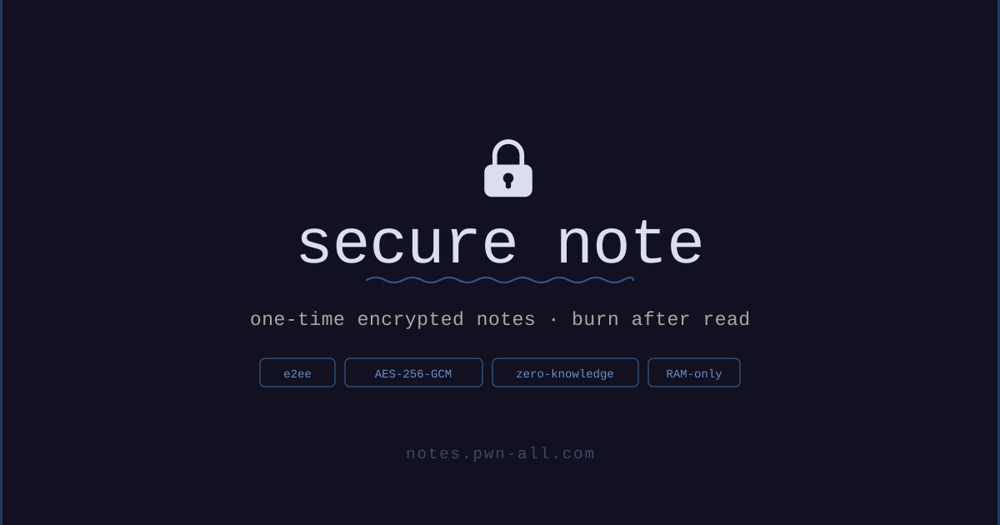
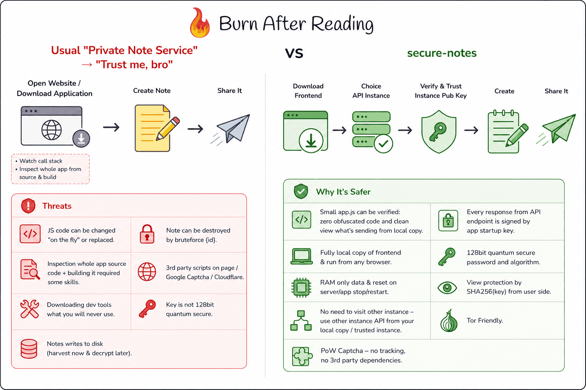

# SecNote

[](https://github.com/pwn-all/secure-notes/actions/workflows/rust.yml)
[](LICENSE)
[](Cargo.toml)
[](website/langs/)
[](website/)
[](website/)





> [Watch the demo on YouTube](https://www.youtube.com/watch?v=5vwtcVFniRk)

RAM-only service for self-destructing end-to-end encrypted notes.

With a trusted frontend, the server receives ciphertext and a secret read token, never the decryption key. Notes are kept in process memory and atomically removed on the first authorized read. Self-hosting requires TLS certificates.

See [the security review](docs/security-review.ru.md) for findings, fixes, OWASP mapping, and deployment limits.

---

## How it works

1. The browser encrypts the note with AES-256-GCM (WebCrypto). The key never leaves the client.
2. The server receives only ciphertext and stores it in RAM — no disk writes.
3. The key lives in the URL `#fragment`, which browsers never include in HTTP requests.
4. The note is atomically deleted on the first read (or when its TTL expires / the process restarts).

## Offline / Tor Browser use

The entire frontend is plain HTML + JS + CSS with no build step, no CDN dependencies, and no server-side rendering. You can:

- **Download once, use anywhere** — copy the entire [`website/`](website/) directory and open `index.html` directly in a browser supporting WebCrypto AES-GCM and Ed25519. Keep the relative paths, including translations and the QR library.
- **Point at any backend** — use `?api=https://your-server` in the URL (or enter it in the settings panel) to connect the local frontend to any SecNote instance.
- **Distrust the server's frontend delivery** — if you don't trust that the server is serving unmodified JS, audit the files once and use your own copy. The server never needs to touch your frontend again.
- **Full functionality offline** — encryption, PoW solving, QR code generation, and i18n all run locally. Only the API calls (`/api/v1/*`) go to the network.

No apps to install, no packages to build, no runtime to configure. Works in air-gapped environments and high-privacy contexts where installing software is not an option.

## Security properties

| Property | Detail |
|---|---|
| Zero-knowledge server | Stores `nid`, `blob`, a hash of the read token, and expiry — never the AES key when using a trusted frontend |
| Burn protection | Reading requires `view_token = SHA-256(aes_key)`; knowing only `nid` is not enough |
| Payload-bound PoW | `SHA-256(challenge ‖ nonce ‖ SHA-256(ttl ‖ blob))` — challenge can't be reused for a different payload |
| One-time challenge | Both challenge and note are consumed atomically |
| IP privacy | Anti-abuse state keyed on `SHA-256(IP ‖ server_salt)`; raw IPs never stored |
| Ephemeral salt | `server_salt` is random per process start; all anti-abuse state lost on restart |
| Authenticated API responses | Ed25519 signatures bind response bytes, status, method, path/query, request body hash, and a fresh client nonce; protection requires a trusted frontend and signing key |
| Strict CSP | `default-src 'none'` with minimal allowlist |
| Offline shell | Service worker caches allowlisted public assets using URLs without queries; API calls always bypass the cache |

---

## Comparison with similar projects

> Legend: ✅ Yes &nbsp;|&nbsp; ⚠️ Partial / optional &nbsp;|&nbsp; ❌ No

| Feature | **SecNote** | [PrivateBin](https://github.com/nicktacular/PrivateBin) | [Cryptgeon](https://github.com/cupcakearmy/cryptgeon) | [Yopass](https://github.com/jhaals/yopass) | [One-Time Secret](https://github.com/onetimesecret/onetimesecret) |
|---|:---:|:---:|:---:|:---:|:---:|
| **Backend language** | Rust | PHP | Rust + TS | Go | Ruby |
| **Storage** | RAM only | Filesystem / DB | Redis / RAM | Memcached / Redis | Redis |
| **External service required** | ✅ None | ✅ None | ⚠️ Optional | ❌ Required | ❌ Required |
| **Client-side encryption** | ✅ | ✅ | ✅ | ✅ | ❌ Server-side |
| **Zero-knowledge server** | ✅ | ✅ | ✅ | ✅ | ❌ |
| **Burn after read** | ✅ | ✅ | ✅ | ✅ | ✅ |
| **Authenticated API responses** | ✅ Ed25519 per-response | ❌ | ❌ | ❌ | ❌ |
| **Anti-spam / bot protection** | ✅ Proof-of-Work | ⚠️ CAPTCHA opt-in | ❌ | ❌ | ❌ |
| **Burn-read protection¹** | ✅ `view_token` | ❌ | ❌ | ❌ | ❌ |
| **IP privacy by design** | ✅ Hashed | ❌ Raw IPs | ❌ Raw IPs | ❌ Raw IPs | ❌ Raw IPs |
| **Built-in TLS** | ✅ Rustls | ❌ Web server | ❌ Proxy | ❌ Proxy | ❌ Proxy |
| **PWA + offline support** | ✅ | ❌ | ❌ | ❌ | ❌ |
| **Downloadable offline frontend²** | ✅ Open as local file | ❌ Needs PHP | ❌ Needs build | ❌ Needs build | ❌ Server-rendered |
| **Tor Browser compatible** | ✅ | ⚠️ JS-heavy | ❌ | ❌ | ❌ |
| **i18n** | ✅ 12 languages | ✅ Many | ⚠️ Few | ❌ English only | ❌ English only |
| **Self-host: zero config** | ✅ | ✅ | ⚠️ Needs Docker | ⚠️ Needs Docker | ⚠️ Needs Redis |
| **License** | GPL-3.0 | zlib | AGPL-3.0 | Apache-2.0 | MIT |

¹ *Burn-read protection means knowing the note ID alone is not sufficient to read the note — a second secret derived from the encryption key is also required. Without this, anyone who observes a note ID (e.g. from a server log) can burn the note before the intended recipient reads it.*

² *Downloadable offline frontend means you can save the static files locally and open them directly in a browser (including Tor Browser) without any server, build tool, or package manager. Use `?api=https://your-server` to point your local copy at any backend.*

**Where SecNote trades off:** state is volatile — notes are lost if the server restarts. There is no persistent backend; RAM-only storage is the threat model, not a limitation to work around.

---

## Running locally

```bash
cargo run
```

No configuration required — the API URL and privacy policy auto-detect from the page origin. The server starts on `0.0.0.0:443` (HTTPS) and `0.0.0.0:80` (redirect) and requires TLS certificates at startup.

Default TLS paths: `/etc/letsencrypt/live/localhost/fullchain.pem` and `privkey.pem`.  
Override with `TLS_CERT_PATH` / `TLS_KEY_PATH` or copy `.env.example` → `.env`.

## One-click setup (certbot + .env)

`scripts/1click.sh` gets a Let's Encrypt certificate and writes the paths into `.env` in one step.

```bash
sudo ./scripts/1click.sh example.com admin@example.com
```

- Runs certbot in standalone mode (binds `:80` temporarily — requires root and a free port 80).
- Idempotent: skips certbot if the certificate files already exist.
- Creates `.env` from `.env.example` if it doesn't exist yet, then sets `TLS_CERT_PATH`, `TLS_KEY_PATH`, and `PUBLIC_HOST` automatically.
- Writes `.env` with mode 0600. With `sudo`, the file belongs to root.

For production, build the release binary and run it through a service configured for a dedicated user:

```bash
cargo build --release --locked
```

Configure the service manager to load the private `.env` and grant the service user read access to private certificate copies. Use high listener ports behind an ingress or grant only the low-port bind capability. An ordinary `cargo run` cannot read the root-owned `.env` and Let's Encrypt private key created by this setup. Keep those files private. Set a stable `SIGNING_KEY` before publishing, and configure certificate renewal followed by SIGHUP to the running server.

**Optional env vars for the script:**

| Variable | Default | Description |
|---|---|---|
| `LETSENCRYPT_DIR` | `/etc/letsencrypt/live` | Base directory for certificate files |
| `LETSENCRYPT_STAGING` | `0` | Set to `1` to use Let's Encrypt staging CA (for testing) |
| `ENV_FILE` | `<repo-root>/.env` | Path to the `.env` file to write |

## Docker

The image builds the application, can obtain its initial certificate, and starts the server as UID/GID 65532 after certificate setup. Docker can fetch the source directly from GitHub.

Before production startup, create a private `.env.production` (mode 0600) containing your unique `SIGNING_KEY` and `PUBLIC_HOST=example.com`. Generate the signing seed with the command under [Response signing](#response-signing). These values keep client pins stable and fix the HTTP redirect destination. The file is excluded from Git and the Docker build context.

### One-click (auto Let's Encrypt)

```bash
docker build -t secnote https://github.com/pwn-all/secure-notes.git

docker run -d \
  --name secnote \
  --restart unless-stopped \
  --env-file .env.production \
  -p 80:80 \
  -p 443:443 \
  -v letsencrypt:/etc/letsencrypt \
  -e DOMAIN=example.com \
  -e EMAIL=admin@example.com \
  secnote
```

On startup the container runs certbot, which keeps certificates that are not due for renewal. The `/etc/letsencrypt` volume persists ACME material. The entrypoint copies the certificate and private key into `/run/secnote` with restricted access, then drops root privileges before running the server. The application retains only `NET_BIND_SERVICE` for low listener ports, or no capabilities for high ports, and enables `no_new_privs`.

The entrypoint does not schedule ongoing renewal. Configure an ACME renewal service; standalone validation requires a free port 80, so use a suitable DNS/webroot validation or a separate ACME listener for renewal while SecNote is running. After renewal, update the running container's private copies and request TLS reload:

```bash
docker exec --user 0 secnote /app/entrypoint.sh --reload-tls
```

Confirm `TLS certificate reloaded without restarting the server` in the server logs. A malformed certificate/key pair keeps the previous active TLS configuration. Successful reload preserves notes and the signing key; restarting the container clears notes.

Set `-e LETSENCRYPT_STAGING=1` to use the Let's Encrypt staging CA while testing.

### Bring your own certificate

If you already have a certificate (from certbot, another ACME client, or a CA):

```bash
docker run -d \
  --name secnote \
  --restart unless-stopped \
  --env-file .env.production \
  -p 80:80 \
  -p 443:443 \
  -v /etc/letsencrypt:/etc/letsencrypt:ro \
  -e TLS_CERT_PATH=/etc/letsencrypt/live/example.com/fullchain.pem \
  -e TLS_KEY_PATH=/etc/letsencrypt/live/example.com/privkey.pem \
  secnote
```

Notes hold no state outside the process — there is no data volume to mount. Restarting the container clears all notes (by design).

For an explicitly nonroot container, mount certificate/key files readable by that user and select high listener ports. In that mode the entrypoint uses the supplied files directly; update them and send SIGHUP to the server after renewal.

## Environment variables

The defaults support startup when the default TLS files exist. Production should set `PUBLIC_HOST`, a stable private `SIGNING_KEY`, and the instance's certificate paths or Docker ACME settings.

| Variable | Default | Description |
|---|---|---|
| `HTTP_BIND_ADDR` | `0.0.0.0:80` | HTTP redirect listener |
| `HTTPS_BIND_ADDR` | `0.0.0.0:443` | HTTPS listener (`BIND_ADDR` is a legacy alias) |
| `PUBLIC_HOST` | (from `Host` header) | Hostname used in HTTP→HTTPS redirects; inferred from the request `Host` header if not set |
| `TLS_CERT_PATH` | `/etc/letsencrypt/live/localhost/fullchain.pem` | TLS certificate chain |
| `TLS_KEY_PATH` | `/etc/letsencrypt/live/localhost/privkey.pem` | TLS private key |
| `CHALLENGE_TTL_SECS` | `150` | PoW challenge lifetime |
| `POW_BITS_CREATE` | `17` | Base PoW difficulty for note creation (alias: `POW_BITS`) |
| `POW_BITS_CREATE_MAX` | `28` | Max PoW difficulty under load (alias: `POW_BITS_MAX`) |
| `POW_BITS_VIEW` | `16` | Base PoW difficulty for note reading |
| `POW_BITS_VIEW_MAX` | `24` | Max PoW difficulty for reading under load |
| `MAX_PLAINTEXT_BYTES` | `32768` | Maximum plaintext size, clamped to 1–32768 UTF-8 bytes |
| `MAX_BLOB_BYTES` | `49152` | Maximum base64url-encoded blob size, clamped to 39–49152 bytes |
| `MAX_NOTE_STORAGE_BYTES` | `67108864` | Total stored encoded ciphertext budget (64 MiB); excludes map overhead, TLS, and request buffers |
| `MAX_NOTES` | `50000` | Maximum active notes |
| `MAX_ACTIVE_CHALLENGES` | `10000` | Maximum active PoW challenges |
| `MAX_TRACKING_ENTRIES` | `100000` | Maximum entries in each anti-abuse tracking map |
| `MAX_CONCURRENT_API_REQUESTS` | `64` | API requests processed concurrently, clamped to 1–1024; excess requests receive 503 |
| `POW_FAIL_WINDOW_SECS` | `600` | Window for counting PoW failures per IP |
| `BAN_SHORT_SECS` | `300` | Short ban (3+ failures) |
| `BAN_MEDIUM_SECS` | `1800` | Medium ban (6+ failures) |
| `BAN_LONG_SECS` | `43200` | Long ban (10+ failures) |
| `SIGNING_KEY` | (random at startup) | Base64url-encoded 32-byte Ed25519 signing key seed. Set this to keep the public key stable across restarts so pinned clients don't need to re-trust after a redeploy |
| `CLEANUP_INTERVAL_SECS` | `30` | Expired entry cleanup interval |
| `RATE_INIT_PER_MIN` | `30` | `/api/v1/init` rate limit per IP |
| `RATE_CREATE_PER_MIN` | `30` | Note creation rate limit per IP |
| `RATE_VIEW_PER_MIN` | `60` | Note reading rate limit per IP |

## API

Base URL is the server's own origin; no API key required. All write operations require a solved PoW challenge.

### Response signing

Responses from `/info` and `/api/v1/*` after the bounded request body has been read carry an Ed25519 signature. The official client supplies a fresh, random 16-byte base64url nonce in `x-secnote-request-id` and requires:

```text
x-secnote-sig-v2: <base64url(Ed25519 signature)>
```

The signed message is the following UTF-8 prefix followed by the **raw response body bytes**, with a newline after every prefix line:

```text
secnote-response-v2
<uppercase HTTP method>
<exact path and query>
<x-secnote-request-id>
<base64url(SHA-256(raw request body bytes))>
<decimal HTTP status>
```

Use the SHA-256 of an empty body for a bodyless request. A client must compare the signature with its own request context and a new nonce for every request. The official frontend verifies the raw bytes before decoding JSON. It rejects missing/invalid v2 signatures and never falls back to the legacy signature. Request bodies and handler execution each have a 10-second deadline. Overload, invalid request IDs, and failures while reading the request body are rejected before a complete signing context exists; these early errors may be unsigned and are treated as untrusted failures by the official client.

The legacy header is retained for API compatibility; it authenticates **only the body** and provides no replay or request-context protection:

```
x-secnote-sig: <base64url(Ed25519 signature of the raw response body bytes)>
```

The server's Ed25519 public key is returned by `GET /info` as `pubkey` (base64url, 32 bytes). By default it changes on every restart. Once the client trusts a key, v2 signatures detect forged/replayed responses even if TLS is intercepted, provided the client code itself remains trusted. Signatures do not hide requests or protect the frontend delivered by a compromised server.

#### Public key trust model

Because the signing key is ephemeral, the client must learn the server's current public key before it can verify responses. The trust flow works as follows:

1. **First connect** — without an existing trusted key, the client fetches `GET /info` without signature verification to retrieve `pubkey`. Same-origin keys are learned automatically; a new external API requires a trust decision. This first exchange relies on the transport and frontend delivery being trustworthy.
2. **TOFU storage** — the fetched key is saved in `localStorage` keyed by API origin. All subsequent requests to that origin are verified against the stored key before any response body is parsed.
3. **Pre-pinning** — if you obtained the public key out-of-band (e.g. from the server's startup log), you can supply it as `<api-url>|<base64url-pubkey>` in the `?api=` query parameter or in the settings panel. The client then skips the TOFU round-trip and trusts only that key from the start.
4. **Stable key across restarts** — by default the key is regenerated on every restart, which invalidates stored trust. Set the `SIGNING_KEY` environment variable (base64url, 32-byte Ed25519 seed) to keep the public key constant so pinned clients don't need to re-trust after a redeploy.

An attacker present during the first unpinned connection can substitute their own key. For that threat model, distribute a trusted frontend and obtain the signing public key through an independent channel. A TLS interceptor can also observe read tokens, alter or block requests, and deny service; response signing does not prevent these actions.

To generate a unique stable signing seed, run:

```bash
python3 -c "import secrets,base64; print(base64.urlsafe_b64encode(secrets.token_bytes(32)).decode().rstrip('='))"
```

Store the seed in a private `.env` or secret store as `SIGNING_KEY`. Do not commit it. If a legitimate signing key changes, manually verify the replacement and enter `<api-url>|<new-public-key>` in settings; saving an unchanged URL preserves existing trust.

### `GET /api/v1/init?scope=create|view`

Returns a PoW challenge, encryption parameters, and server limits.

```json
{
  "ok": true,
  "server_time": 1700000000,
  "pow": {
    "scope": "create",
    "alg": "sha256-leading-zero-bits",
    "bits": 22,
    "expires_at": 1700000150,
    "challenge": "<base64url>"
  },
  "encryption": { "alg": "aes-256-gcm", "key_bytes": 32, "nonce_bytes": 12, "tag_bytes": 16 },
  "limits": { "max_plaintext_bytes": 32768, "max_blob_bytes": 49152, "ttls": [43200, 86400] }
}
```

### `POST /api/v1/notes`

```json
{
  "alg": "aes-256-gcm",
  "challenge": "<base64url>",
  "nonce": "<base64url(pow_nonce)>",
  "ttl": 43200,
  "blob": "<base64url(iv ‖ ciphertext ‖ tag)>",
  "view_token": "<base64url(SHA-256(aes_key_bytes))>"
}
```

Response: `{ "ok": true, "nid": "<base64url>", "expires_at": 1700086400 }`

### `POST /api/v1/notes/{nid}/view`

```json
{
  "challenge": "<base64url>",
  "nonce": "<base64url(pow_nonce)>",
  "view_token": "<base64url(SHA-256(aes_key_bytes))>"
}
```

Response: `{ "ok": true, "blob": "<base64url(iv ‖ ciphertext ‖ tag)>", "deleted": true }`  
Gone/expired: `410` with `{ "ok": false, "error": { "code": "gone", "message": "note is gone" } }`

### `GET /info`

`{ "ok": true, "notes": 42, "ram_usage": "2 mb", "pubkey": "<base64url>" }` — anonymous aggregate plus the server's Ed25519 public key. The client fetches this endpoint on first connect to obtain the key for signature verification (see [Public key trust model](#public-key-trust-model) above).

## Frontend

Static files served from `website/`. The Rust backend handles only `/api/v1/*`, `/info`, and `/.well-known/api-catalog`; everything else is served by `ServeDir`.

| File | Purpose |
|---|---|
| `index.html` | App shell |
| `app-config.js` | Empty runtime config — API URL auto-detects from `location.origin` |
| `app.js` | Client logic: encryption, PoW, i18n, privacy policy rendering |
| `pow-worker.js` | PoW solver (Web Worker) |
| `styles.css` | Styles |
| `sw.js` | Service worker (offline shell cache) |
| `manifest.json` | PWA manifest |
| `langs/*.json` | UI translations (12 languages) |

The frontend auto-connects to the API at its own origin — no configuration needed. Use `?api=https://other-host` to point at a different backend.

Privacy Policy and contact email are rendered client-side from `location.host`, so self-hosted instances get the correct operator information without any setup.

## Self-hosting

1. Clone the repo and build: `cargo build --release`
2. Get a TLS certificate for your domain (see above)
3. Set `TLS_CERT_PATH` / `TLS_KEY_PATH` pointing to your cert, then run the binary
4. Open your domain — the UI connects to your API automatically

The Privacy Policy shown to users will automatically display your domain and `legal@yourdomain` as the contact. Update the policy text in `website/index.html` if needed to reflect your jurisdiction.

## Tests

```bash
cargo test --locked
node --test tests/*.test.cjs
cargo fmt --check
cargo clippy --locked --all-targets -- -D warnings
cargo audit --deny warnings
cargo build --release --locked
node tests/runtime-smoke.cjs --binary target/release/secure_notes
```

The runtime smoke uses isolated temporary certificates and a test signing seed. It checks real TLS/HTTP2, signed API operations, burn protection, live certificate reload, and the incomplete-header deadline. It requires Node.js with WebCrypto, OpenSSL, and permission to bind local test ports.

## Third-party code

[qrcode-svg](https://github.com/datalog/qrcode-svg) — MIT License. Copyright and license notice retained in this repository.

## Deployment security

Set `PUBLIC_HOST` to your instance hostname to give HTTP redirects a fixed destination. The certificate setup scripts set it from the supplied domain. Keep `SIGNING_KEY` private and stable across redeploys, and publish the backend and frontend together because the official client requires signature v2.

The server limits HTTP/1 headers to 32 KiB/64 fields with a 10-second read deadline. HTTP/2 permits 64 concurrent streams and a 16 KiB header list, with keepalive checks. Configure ingress limits for total connections, initial bytes, idle sockets, and aggregate request rate; protocol detection and an incomplete HTTP/2 preface precede these handler limits. A reverse proxy also changes the IP observed by built-in rate limits; forwarded headers must follow an explicit trusted-proxy policy.

Before opening a Docker deployment to the public, build and run the exact image on Linux, exercise note creation/read and certificate renewal/reload, and verify its runtime identity:

```bash
docker exec secnote sh -c 'awk "/^(Uid|Gid|CapEff|CapBnd|NoNewPrivs):/" /proc/1/status'
```

Expect UID/GID 65532, `NoNewPrivs: 1`, and only the low-port bind capability (`0000000000000400`) for default ports, or zero capabilities for high ports. Root is used for setup and the explicit TLS-copy refresh. The root entrypoint needs permission to change UID/GID and capabilities during initialization; it fails if privilege reduction cannot complete. Validate the public certificate chain, redirect, headers, and CI result for the release as well.

RAM-only application storage does not disable swap, core dumps, VM snapshots, browser history, clipboard history, or recipients' ability to copy plaintext. The note is removed when the API accepts an authorized read, before delivery and browser decryption; a network failure can therefore lose the note. Physical removal of expired entries occurs on the cleanup interval, though expired notes cannot be read. Publish an instance privacy notice that matches your actual logs and infrastructure.
